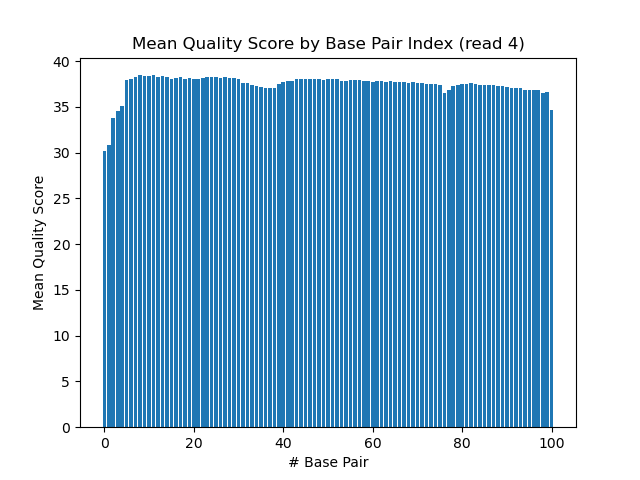

# Assignment the First

## Part 1
1. Be sure to upload your Python script. Provide a link to it here: [distributions.py](distributions.py)

| File name | label | Read length | Phred encoding |
|---|---|---|---|
| 1294_S1_L008_R1_001.fastq.gz | read1 | 101 | Phred+33 |
| 1294_S1_L008_R2_001.fastq.gz | index1 | 8 | Phred+33 |
| 1294_S1_L008_R3_001.fastq.gz | index2 | 8 | Phred+33 |
| 1294_S1_L008_R4_001.fastq.gz | read2 | 101 | Phred+33 |

2. Per-base NT distribution
    1. Use markdown to insert your 4 histograms here.
    
    
    
    

    What is a good quality score cutoff for index reads and biological read pairs to utilize for sample identification and downstream analysis, respectively? Justify your answer.

    2. No quality score cutoff for either.

    As far as index reads are concerned, we can look into the hamming distance, or the number of positions in which the two strings are different, in order to figure out just how likely it is that an index would be misread as another index which is being used rather than simply not being identified.

    I wrote a script, [hamming.py](hamming.py), in order to graph the distribution of hamming distance across all possible combinations of indices which are provided in the `indexes.txt` file on talapas.

    

    This shows that, in the worst-case (and least likely) scenario, the correct 3 bases would need to be not only misread, but misread to match the other index sequence exactly. The odds are unlikely enough that this is acceptably rare, and justifies not needing a q score threshold for the 

    How many indexes have undetermined (N) base calls? (Utilize your command line tool knowledge. Submit the command(s) you used. CHALLENGE: use a one-line command)

    3. 3328051
    ```bash
    zcat /projects/bgmp/shared/2017_sequencing/1294_S1_L008_R3_001.fastq.gz | sed -n '2~4p' | grep 'N' | wc -l
    ```
    
## Part 2
1. Define the problem
2. Describe output
3. Upload your [4 input FASTQ files](../TEST-input_FASTQ) and your [>=6 expected output FASTQ files](../TEST-output_FASTQ).
4. Pseudocode
5. High level functions. For each function, be sure to include:
    1. Description/doc string
    2. Function headers (name and parameters)
    3. Test examples for individual functions
    4. Return statement
